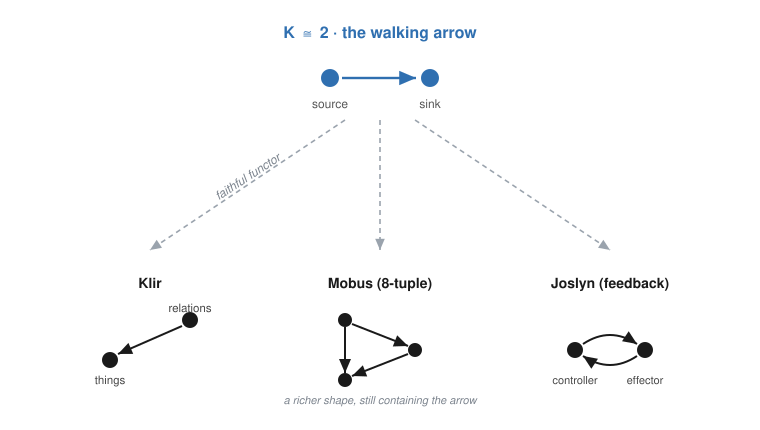
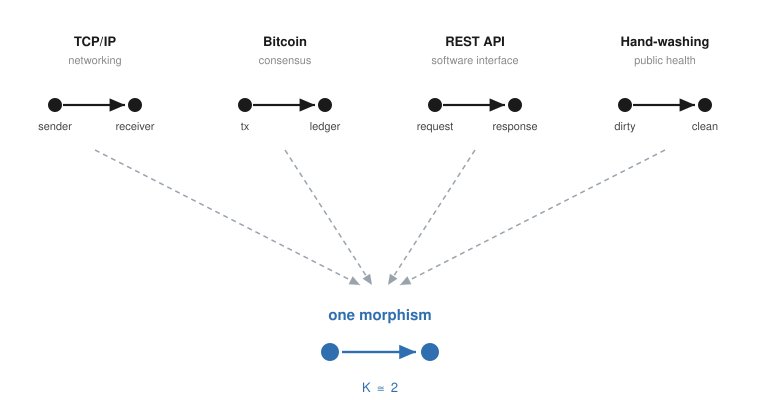

# Protocols Are Morphisms: On the Common Core of Coordination

*Shingai Thornton, Halcyonic Systems*
*May 2026*

---

In January 2025, I started writing a document called "Protocol Science." It began with an anomaly. Bitcoin should not work — not by the dominant analytical framework. In 2014, Eyal and Sirer proved selfish mining becomes profitable for any pool past a third of the hashrate; rational miners should have defected, pools should have grown, the network should have centralized. Peer-reviewed game theory, not speculation. Twelve years later, pools have crossed that line more than once — GHash.io briefly passed 51% — and backed off rather than attack. Either the analysis was wrong, or the framework was inadequate.

I argued the latter — not that game theory is wrong, but that it is a special case, accurate when its assumptions hold and misleading when they don't. Game theory was projected onto blockchain by researchers using familiar tools (Babaioff 2011, Kroll 2013, Eyal & Sirer 2014). It was never discovered within these systems by their builders. The foundational whitepapers (Nakamoto 2008, Buterin 2014) contain no Nash equilibria, no payoff matrices. They contain cryptography, distributed systems, and informal arguments about incentives. Even back in 2015, Ethereum's chief protocol researcher Vlad Zamfir acknowledged the gap, calling game theory "*just* one thing in our toolbox" and calling for "a formal discipline that studies protocols." He was describing something that did not yet exist. It still does not, formally.

Fifteen months after I started that document, the Protocol Institute launched, searching for formal foundations that, from where I sit, already exist. Not because I built them for protocols. Because I built them for *systems*, and protocols turned out to be a type of system.

This letter is a bridge.

---

## The Convergence Wager

In "Theorizing Protocolization II," Venkatesh Rao poses the central question: do protocols constitute a genuine *kind*? A natural category that licenses productive cross-domain reasoning, or a useful metaphor stretched past its warranty?

The question has a precise mathematical form. In category theory, a *category* is a structured collection of objects with composable morphisms between them. It is the minimal machinery that supports systematic reasoning across instances: if two things live in the same category, what you prove about the category's structure applies to both. When Rao asks whether protocols constitute a genuine kind, the mathematical translation is: do protocols form a category?

He proposes a test. Independent formalizations converging on the same structure. The standard: Turing machines, Church's lambda calculus, Kleene's recursive functions, Post's production systems. Four independent approaches to "computability" in the 1930s. All four turned out to define the same class. That convergence proved *computable* was a category of equivalent formalisms, not a vague intuition. The convergence test has a specific virtue Rao has identified in other recent work: it replaces claims of perspicacity backed by narrow win records with structural evidence anyone can check.

A few months ago I ran a similar test. Not for protocols. For systems.

## Seven Traditions, One Morphism

I formalized seven independently developed definitions of "system" in Lean 4 (a proof assistant for machine-verified mathematics). The traditions:

- **Klir** (Czech, information theory, 1960s): things and relations
- **Bunge** (Argentina, ontology, 1970s): composition, environment, structure
- **Mobus** (US, systems engineering, 2020s): the 8-tuple (components, network, environment, flows, boundary, transforms, history, timescale)
- **Myers** (US, I/O systems): state, input, output
- **Wymore** (US, systems design): readout with temporal mediation
- **Mesarovic** (Serbia, mathematical systems theory): input-output response
- **Joslyn** (US, cybernetics): controller, effector, controlled, with feedback

Different countries. Different decades. Different motivations. Different formalisms.

All seven converge on a single categorical structure: **the walking arrow**. Two objects, one morphism. In category theory, this is the category **2**. The result, which I call K ≅ **2**, says: the irreducible content shared by every formal definition of "system" is a single directed dependency. Relations depend on things. A flow requires something to flow between. A constraint requires something to be constrained.

This is machine-verified: 6,200 lines of Lean 4 and zero unresolved proof obligations. The proof is easier to picture than it sounds. Draw each tradition as a small diagram of what-depends-on-what (a "shape category": positions joined by arrows that encode the tradition's structural commitments). The convergence is the claim that the same two-dot arrow sits inside every one of those diagrams, with no collapsing of distinct things — formally, a faithful functor from the walking arrow into each shape. A maximality proof (via pigeonhole) establishes that no simpler structure suffices.

{width=80%}

The convergence test passed. *System* is a category. The walking arrow is that category. The seven traditions are different views of the same structure, and what you prove about the walking arrow (composition, governance, layering, feedback) applies to every tradition, because they all live in the same categorical home. That is what it means for something to be a genuine kind.

## Your Definitions Are System Definitions

Here is what interests me about the Protocol Institute's own writing.

Rao defines protocolization as "the progressive metabolization of reliably repeatable, technologically mediated human behaviors into planetary coordination infrastructure." Unpack that. You have things — humans, technologies — and a directed dependency running between them: behavior metabolizing into infrastructure. Two kinds of object, one arrow pointing from source to sink. That is the walking arrow. That is K ≅ **2** — not by analogy, but because the definition has the same shape as the structure the seven traditions converge on.

Stinson-Schroff defines protocols as "engineered arguments, mostly predefined rule sets allowing individual actors to make trade-offs without becoming embattled." Rule sets (relations) defined over actors (things). This is Klir's things-and-relations definition of a system, stated in different words.

Rao's "protocol tangles" (emergent composite phenomena from co-evolving protocols that resist analysis through any single disciplinary lens) are system compositions. The formalization proves that composition is unconditional: any two systems with disjoint components compose into a valid supersystem, and the composed environment is computed automatically. The "resistance to analysis" that Rao identifies is what happens when you try to analyze composed morphisms as if they were isolated objects.

None of this is analogy. Every time the Protocol Institute defines what a protocol is, it writes down things and directed dependencies between those things. The walking arrow is not being imposed from outside. It is already inside the definitions.

## Four Protocols, One Structure

But structural identity at the level of definitions is a claim about language, not about the world. Rao's wager demands more. It demands that independent *instances* of protocols converge on shared structure. So:

**TCP/IP.** Things: sender, receiver, packets, ports. The protocol IS the directed dependency: reliable delivery from sender to receiver through sequencing, acknowledgment, and retransmission. The rules (packet ordering, timeout windows, congestion backoff) are relations defined over network entities. K ≅ **2**.

**Bitcoin.** Things: miners, nodes, transactions, blocks. The protocol IS the directed dependency: valid transactions flow from proposer to confirmed ledger through proof-of-work validation. The rules (difficulty adjustment, block reward halving, UTXO constraints) are relations defined over network participants. K ≅ **2**.

**REST APIs.** Things: client, server, resources. The protocol IS the directed dependency: requests flow from client to server through constrained verbs (GET, POST, PUT, DELETE), responses flow back. Any language (Python, Rust, JavaScript) can implement the same API because the morphism is substrate-independent. It does not care about the internal structure of the source and sink. K ≅ **2**.

**Hand-washing** (Rao's own example from Part I). Things: hands, soap, water, pathogen. The protocol IS the directed dependency: contamination flows from contact-state to resolved-state through a constrained physical procedure. The 20-second scrub is a relation defined over physical elements. K ≅ **2**.

Four protocols. Four domains (networking, consensus, software interfaces, public health). One structure. The morphism. The directed dependency that constrains how things interact.

{width=80%}

The categorical approach to protocol analysis has existing precedent. Melanie Swan's "Categorical Cryptoeconomics" (2024) catalogs twenty categorical primitives for blockchain study (optics, Petri nets, sheaves, homotopy type theory) and demonstrates that blockchain protocols have rich categorical structure. Swan proved the approach works for one protocol domain. K ≅ **2** says it generalizes: the categorical structure is not specific to blockchain. It is the common core of all systems, and therefore all protocols. Protocols are not merely describable in categorical terms. They *are* a category.

And protocol composition becomes concrete. TCP composed with HTTP composed with TLS gives you HTTPS. In the formalization, the composition theorem applies without preconditions. A separate result (conditional time-scale separation, building on Simon's near-decomposability) proves that protocol layering produces temporal hierarchy: lower layers run faster than higher layers. This is not an engineering heuristic. It is a structural consequence of how systems compose.

## What Protocol Theory Would Inherit

If protocols are systems (and the definitions and instances both say they are), then protocol theory inherits the formal infrastructure that systems science has already built. Some of what is available, machine-verified:

- **Composition closure.** Two protocol systems compose into a valid supersystem. The interface of the composed system is derived automatically. No compatibility preconditions.
- **Governance as feedback.** A governed protocol is a system with a set point (the invariant the protocol maintains), a sensor (observation of protocol state), an error function (deviation from invariant), and a corrective law. The formalization proves the target state is a fixed point.
- **Session semantics.** A protocol session is a lens: a bidirectional channel with get (observe/send) and put (receive/respond). Lens composition is associative. Sessions can be chained without re-proving compatibility.
- **Layering as near-decomposability.** Within-layer interactions are tighter than cross-layer interactions. This produces time-scale separation. The formalization names an assumption Simon left implicit (strict anti-monotonicity of interaction strength across levels) and proves the time-scale result conditional on it.

All four are formalized and machine-checked — compiled, with zero unresolved proof obligations.

## What This Does Not Do

K ≅ **2** is the floor, not the ceiling.

It tells you the minimum shared structure of coordination. It does not tell you what makes TCP/IP different from Bitcoin. That is in the *elaborations*: time, feedback, agent heterogeneity, enforcement mechanisms, economic layers, governance hierarchies. The interesting protocol science lives in those elaborations, not in the common core alone.

The protocol instantiations in this letter are informal. The seven systems traditions are machine-verified. Mapping TCP/IP or Bitcoin formally as Mobus's 8-tuples (components, network, environment, flows, boundary, transforms, history, timescale) in Lean 4 is tractable work, but it has not been done. The structural observations here are exactly that: observations, not proofs.

There is a specific open problem in the categorical layer. Among the seven traditions, Joslyn's cybernetic shape is the only one with cycles (the controller-effector feedback loop generates infinitely many morphisms). Cyclic structure is the natural home for protocol execution: the repeating send/receive/respond pattern. Composing cyclic systems requires traced monoidal categories, which the current formalization does not address. This is where protocol theory would push the systems formalization into genuinely new territory.

The claim that "genuine kind" cashes out as *category* in the mathematical sense is itself a formalization, not an identity. Philosophy of science has older debates about natural kinds. But category theory is the strongest available language for what Rao means when he asks whether protocols support productive cross-domain reasoning. If instances compose, if structure transfers, if what you prove about one applies to others, you have a category. The convergence test is how you demonstrate it.

K ≅ **2** is a structural claim, not a predictive one. Knowing that protocols share the walking arrow does not tell you which protocols will succeed or fail. Prediction requires the elaborations, the concrete instances, the empirical grounding.

## Why Now

One reason this letter exists now and could not have existed two years ago: the tools arrived.

In May 2026, Google DeepMind's AlphaProof Nexus used LLM-assisted Lean 4 proving to solve nine open Erdos problems, including problems open for 56 years. The methodology: AI agents generate proof sketches, human mathematicians validate that formalizations faithfully capture conjectures, and the Lean compiler eliminates hallucination risk through machine verification. Cost: roughly sixty dollars per problem.

In the same month, OpenAI's reasoning model autonomously disproved a 1946 conjecture in discrete geometry, producing a 125-page proof that connected algebraic number theory to combinatorics in ways human mathematicians had not explored. Fields medalist Tim Gowers verified the result.

The systems-science formalization I describe was built with a similar methodology. A human researcher (trained in the Mobus/Klir/Bunge tradition) decides what to formalize and why it matters. LLMs assist with Lean code generation and proof search. The Lean compiler accepts or rejects every step. The intellectual judgment is human. The verification is mechanical. The packaging bottleneck that kept systems science trapped in prose for decades is dissolving.

This methodology applies directly to protocol theory. The formal infrastructure exists (Lean 4, mature libraries, proof automation); the conceptual infrastructure exists (seven traditions, the common core, the shape categories). What is missing is the concrete application: protocols formalized as systems, their elaborations proved.

## The Invisible Tradition

There is an irony here that the Protocol Institute, of all institutions, might appreciate.

The Protocol Institute's canon (Scott, Ostrom, Perrow, Brand, Jacobs, Galloway) includes no Klir, no Bunge, no Mobus. Cybernetics had Wiener's public fame. Complexity had the Santa Fe Institute's brand. Systems science had Bunge in a philosophy department and Klir in a systems science program nobody outside Binghamton had heard of.

The tradition that formalized exactly what protocol theory needs is invisible to it. Per the Protocol Institute's own thesis, that is what happens to successful infrastructure. Systems science protocolized its insights into textbooks, curricula, and engineering practices so thoroughly that the source tradition disappeared from view.

Rao writes that protocolization's defining feature is invisibility: "mature protocols work precisely because people stop noticing them." Systems science is a mature protocol for reasoning about systems. It works. Nobody notices.

There is a second mechanism for the invisibility. In recent writing on AI futures, Rao distinguishes *being right* from *winning* and observes that the people worth betting on are "mostly weakly attached" to the ecologies organized around winning. Klir at Binghamton. Bunge in Buenos Aires. Mobus at UW Tacoma. The tradition that formalized what protocol theory needs was built by people solving for rightness in quiet departments, not playing narrow games in visible ones. By Rao's own criterion, the invisible tradition is precisely where he should look.

## An Invitation

I am not proposing that protocol theory adopt systems science wholesale. I am proposing a collaboration shaped like the thing we both study: a feedback loop.

Systems science provides formal foundations (the common core, the shape categories, the composition and governance theorems). Protocol theory provides the concrete instances and the empirical test cases (blockchain consensus, internet transport, civic governance, public health). LLM-assisted theorem proving provides the verification infrastructure that makes the loop tractable at a cost and speed that would have been absurd five years ago.

Each side corrects the other. The formal tradition discovers which of its abstractions actually matter when applied to real protocols. The protocol tradition discovers which of its intuitions survive machine verification. The elaborations that distinguish TCP/IP from Bitcoin from hand-washing become the new formal targets. The Joslyn feedback cycle (the open problem) becomes a joint research question.

Rao asks whether protocols constitute a genuine kind, and proposes convergence as the test. Seven independent systems traditions converged on a single categorical structure. Protocols instantiate that structure, by the Protocol Institute's own definitions and across four independent domains. Swan demonstrated categorical structure in blockchain protocols. The walking arrow proves it generalizes.

Protocols are a category. The wager is settled. The work begins.

---

*This letter was drafted in collaboration with Claude (Opus 4.8, Anthropic), which assisted with research synthesis, structural drafting, and iterative refinement. The intellectual content (K ≅ **2**, the systems-science-foundations formalization, Protocol Science) is the author's research. The collaboration itself is an instance of the methodology described in this letter: human judgment on what matters, AI assistance on packaging, machine verification on correctness.*

*The systems-science-foundations formalization is available at https://github.com/halcyonic-systems/systems-science-foundations. A companion Atomic Protocol Question ("Does the common core of formal system definitions also describe the common core of protocols?") follows as a separate submission to SIGFPT.*
