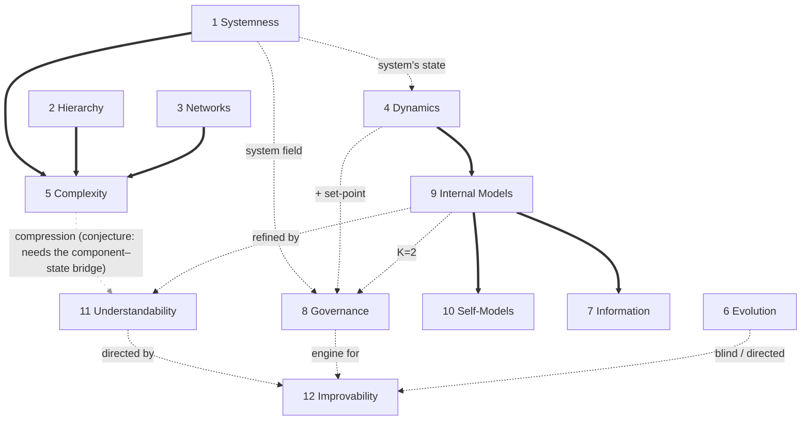

# Twelve principles, eight axioms: the reading edition

*Paper P3 in one legible pass. Prose, mathematics, Lean pointers and context, integrated. Companion to `axiom-table.md` (the figure), `dependency-dag.mmd` (the graph) and `../reference/principles-formalization-companion.md` (the full findings log). Every Lean name in this document was checked against the source tree on 2026-09-03; names that could not be found are listed as such in §9 and §10 rather than silently repaired.*

## Front matter

**Thesis.** Mobus's twelve principles of systems science are not twelve independent commitments. Formalized in Lean 4, they reduce to eight axioms plus four theorems derivable from them, and the derivation corrects several dependency claims Mobus states informally. The general point the reduction demonstrates is that a principles list is a theory, and theories have logical structure that prose cannot expose. Machine-checking a foundational vocabulary tells you which of its commitments are load-bearing.

**Status line (counted 2026-09-03).** The `Systems/` tree holds 74 `.lean` files and 14,365 lines. `grep` finds no `sorry` and no `axiom` declaration anywhere in `Systems/`. The README's banner ("~10,800 lines, 64 files", last touched 2026-08-11) is stale on both counts and should be re-counted at submission. All twelve principles have a machine-checked core; the last (#6 Evolution) landed 2026-06-09.

**How to read this document.** §1 states the result. §2 transcribes what Mobus actually says, with vault line numbers, because the corrections in §6 only land if the transcription is trusted. §3 says what the formalization can and cannot settle, and in particular what "axiom" means here (a Lean `structure`, not a Lean `axiom`). §4 and §5 walk the eight axioms and four theorems in the same block shape: statement, Lean home, headline signature, separating instance, what was found. §6 gives the three corrections. §7 gives the structure behind the list and embeds the DAG. §8 gives the foundational profile. §9 is the claim-hygiene ledger: every claim the paper wants to make against what the kernel has actually seen. §10 lists open stretches and stale document lines. §11 is the pointer map. A reader with thirty minutes should read §1, §4 to §6, and §9; the rest is reference.

---

## §1 What the result is, in five sentences

Mobus lists twelve principles of systems science in prose, labelling two of them "corollaries" and grouping the last seven as the complex-adaptive-systems principles. Each principle was given a tractable formal core in Lean 4 with Mathlib and machine-checked, and the dependency structure was read off the import graph and the theorems. Eight of the twelve are encoded as structures that no other principle's structures produce (#1 Systemness, #2 Hierarchy, #3 Networks, #4 Dynamics, #6 Evolution, #8 Governance, #11 Understandability, #12 Improvability), and four are theorems built from those structures with no new primitive (#5 Complexity from #1+#2+#3, #7 Information, #9 Internal Models from #4, #10 Self-Models as the diagonal of #9). Three of Mobus's informal dependency claims fail under checking: #11 is not a corollary of #9, #12 is not a corollary of #6, and #5 is not an axiom. The twelve thus split into ten ontological principles about what systems are and do plus two agential principles about what an observer or designer does with a system, with a blind/directed axis separating evolution from engineering.

---

## §2 The twelve principles as Mobus states them

Source: Mobus, *Systems Science: Theory, Analysis, Modeling, and Design* (2022), Chapter 2, as held in the vault at `operations/systems-science/mobus/2-principles-of-systems-science.md`. Mobus notes (line 261) that the per-principle paragraphs are quoted from Mobus & Kalton (2015, Chapter 1) "with some additional information not in the original". The abbreviated list is at lines 229 to 240; the subsection headings run from line 267 to line 380. The vault does not hold the Mobus & Kalton 2015 text itself, so the 2015 wording is reached only through the 2022 reprint.

| # | Name | Mobus's one-line statement (verbatim, lines 229 to 240) | Dependency he states, and where |
|---|------|------------------------------------------------------------|----------------------------------|
| 1 | Systemness | "Bounded networks of relations among parts constitute a holistic unit. Systems interact with other systems, forming yet larger systems. The Universe is composed of systems of systems." | "the core of the core principles, meaning that it is connected to all of the other principles" (line 269) |
| 2 | Hierarchy | "Systems are processes organized in structural and functional hierarchies." | Heading credits Simon and Koestler; within-subsystem interactions "are stronger than interactions between components in other subsystems", lower layers have smaller time constants (line 287) |
| 3 | Networks | "Systems are themselves and can be represented abstractly as, networks of relations between components." | "This principle ties several other principles together. Namely, Principles 9 and 11" (line 297) |
| 4 | Dynamics | "Systems are dynamic on multiple time scales." | None stated beyond the spatial-temporal scale correlation (line 323) |
| 5 | Complexity | "Systems exhibit various kinds and levels of complexity." | "complexity is a measure derived from several attributes of system structure" (Simon); "Complexity, like network science, is really one characteristic of systemness" (line 329) |
| 6 | Evolution | "Systems evolve to accommodate long-term changes in their environments." | "Evolution is the overarching principle that determines the long-term unfoldment of the other principles" (line 244); "the most overarching of them all" (line 346); refers forward to #8 (line 347) |
| 7 | Information | "Systems encode knowledge and receive and send information." | None stated |
| 8 | Governance | "Systems have governance subsystems to achieve stability." | Emerges "as systems evolve toward greater complexity" (line 355) |
| 9 | Internal Models | "Systems contain models of other systems (e.g., simple built-in protocols for interaction with other systems and up to complex anticipatory models)." | None stated; #11 is declared its corollary |
| 10 | Self-Models | "Sufficiently complex, adaptive systems can contain self-models." | Restricted to "sufficiently complex, adaptive" systems |
| 11 | Understandability | "Systems can be understood (a corollary of #9)-Science." | "The reason we call this principle a corollary of Principle 9 is that the understanding comes from the efficacy of the models we hold of the systems we study" (line 374) |
| 12 | Improvability | "Systems can be improved (a corollary of #6)-Engineering." | Heading "a Corollary of #6" (line 380); "Principle 6 notes that with available free energy, systems can evolve to higher complexity ... But this is not to say the dynamics that ratchet up complexity automatically lead to improvement" (line 382) |

Two further grouping claims matter for §6 and §7. On principles 11 and 12 (line 259): "These are couched as corollaries to Principles 9 (models within systems) and 6 (evolution). They are special cases of the lower-numbered principles." On principles 6 to 12 (line 342): "The following principles, those outside of the core principles in Fig. 2.5, apply mainly to more complex systems, especially those described as 'complex adaptive systems' (CAS)."

Mobus is careful about the status of the list (footnote 10, line 247): "We neither claimed that these were all of the major principles nor even that they were the major principles, only that they seemed to capture what we felt was the spectrum of systems science."

**Verbatim still owed.** The formalization of #6 cites Mobus & Kalton 2015 §10.2.1.4 ("Fit and Fitness") for the phrase that fitness is "not resident in some mind" (quoted in `Systems/Core/Evolution.lean` header and in the companion, finding 18). That phrase is not in the vault's Mobus text, so it has not been verified against a primary source here. **[SLOT: confirm the §10.2.1.4 and §10.2.2 wording against Mobus & Kalton 2015 before §4.6 quotes it.]**

---

## §3 Method: what "faithful encoding" means here, and what Lean settles

**Tractable cores.** Each principle was given the smallest formal object that carries its distinctive content, stated in the prose tradition's own vocabulary where it has one (Bunge's CES triple for #1, Simon's near-decomposability for #2, Mobus's flow network for #3, the fixed-point notion of equilibrium for #4, a Homeostat for #8, a dynamics homomorphism for #9). The cores are deliberately set-theoretic and discrete. Measure theory (#4, #7), populations and stochastic selection (#6), and Lawvere-style self-reference (#10) are named deferrals, not hidden assumptions.

**What Lean checks.** Three things. First, that each core is consistent, in the sense that it is inhabited: every structure has a concrete witness value in the source (`noisyPairUnderstanding`, `fin3evolution`, `boolImprovement`, and so on). Second, derivability: when a theorem about principle B is proved from principle A's structures alone, the import list and the proof term are the evidence, and `#print axioms` confirms nothing else was used. Third, non-derivability in specific cases: a separating instance is a concrete value that satisfies one core and provably violates another, so the second is not a consequence of the first. Each of these is a machine-checked fact about the encoded objects.

**What Lean cannot check.** Whether the principles are true of the world. Whether a chosen core is the right reading of Mobus's prose. Whether the twelve are all the principles there are. The formalization imposes logical constraints and coherences on a vocabulary; it does not certify that the vocabulary makes good scientific sense. The paper should say this in the register the field's better papers use, and the FormaTheoria precedent (arXiv:2608.10894) gives the modern statement of the same limit: Lean elaboration establishes well-typedness, not semantic fidelity, and layered human review is the recognized answer.

**The eight "axioms" are Lean structures, not Lean axioms.** This is the encoding decision that governs every independence claim in the paper. Lean's `axiom` keyword adds an unproved proposition to the ambient logic; `#print axioms` on any theorem lists the ones it depends on, and the standard three (`propext`, `Quot.sound`, `Classical.choice`) are Mathlib's. SSF adds none: `grep` finds no `axiom` declaration in `Systems/`. Each of the eight systems axioms is instead a `structure` (or a `def` over structures) that packages data with coherence constraints as fields. A `Homeostat` carries a `setPoint`; an `Understanding` carries a `compresses` proof; an `Evolution` carries a `selects` proof.

Two consequences follow. First, "principle A is an axiom" here means "A is encoded as a structure that no other principle's structures produce", not "A is an unproved proposition". The kernel-computed dependency vector (`#print axioms`) therefore measures foundational purity (§8), not systems-level dependency; the systems-level dependency lives in the import graph and in the separating instances. Second, independence of two structures is not something Lean proves wholesale. It is shown one pair at a time, by exhibiting a value that satisfies one and cannot satisfy the other. Where no such value is in the source, the paper has an absence of derivation, not a proof of independence. §9 lists exactly which pairs have a witness.

**Where the encoding decisions are recorded.** File headers carry them. `Systems/Mobus/Tuple.lean` states which 8-tuple slots are structurally active (C, N, E, G, B) and which are carried data with no structural role (T, H, Δt). `Systems/Core/Complexity.lean` states in its header that the import list is the proof. `Systems/Core/Understanding.lean` records why the `nontrivial` field exists. The paper should draw from these, not from summaries of them.

**The pipeline, and who does what.** Four steps, each leaving a record a second reader can check without trusting the first.

| Step | Artifact | Who | What can go wrong here | How it is caught |
|---|---|---|---|---|
| 1. The sentence | Mobus's one-liner, verbatim, with source line (§2; and, per the docstring rule, in the structure's own docstring) | Shingai transcribes; the author owns it | Misquotation, paraphrase drift | Transcription against the primary text; the atlas transcription gate for definitions |
| 2. The tractable core | A Lean `structure` whose fields are the sentence's nouns and whose constraints are its verbs, with named deferrals | Drafted with a model; read against the sentence by Shingai; encoding decisions recorded in file headers | Wrong reading; a noun dropped; a constraint smuggled in | Docstring "Encoding:" and "Not encoded:" lines; cases (step 3); the author (step 4) |
| 3. Consequences and cases | Theorems (derivations), separating instances (non-derivations), inhabitation witnesses (consistency) | Model-drafted proof attempts; the Lean kernel checks every one | A vacuous structure that anything satisfies; a "separation" that separates the wrong thing | `#print axioms`; the vacuity checks in the independence matrix; a constraint owes a separating instance |
| 4. The author's audit | Co-authorship (Mobus on this paper), or a faithfulness ask to the author (Joslyn, SSF#50) | The person whose prose it is | The reading is coherent but not what was meant | Only the author can say; recorded as an author caveat, never silently overwritten |

What Lean guarantees is confined to step 3. Steps 1 and 2 are human readings with a written trail; step 4 is the only check on whether the trail leads to what the author meant. The language model's role is drafting in steps 2 and 3 and nothing in steps 1 and 4; every draft is stamped with how much of it a human has read (the atlas's evidence codes are the general form of that stamp). This division is the paper's method section, and it is also its claim-hygiene: nothing downstream of step 2 is described as "what Mobus says," only as "what this reading of Mobus implies."

---

## §4 The eight axioms

Each block has the same shape: one-line statement; Lean structure or definition and file; the headline theorem with its actual signature; the separating instance, if one exists in source; what was found that the prose tradition lacks. All file paths are under `Systems/`. The headline theorems are re-exported with identical signatures in `Systems/Principles.lean` as `principleN_*`; `#print axioms` can be pointed at either.

### 4.1 Systemness (#1)

**Statement.** A system is a bounded, organized collection of things, each of which is either a process primitive or itself a system; any two systems compose into a supersystem.

**Lean home.** `ConcreteSystem` (`Core/System.lean:34`, Bunge's CES triple with `disjoint`, `structure_on`, `bondage_nonempty`); `RecursiveSystem` (`Core/Systemness.lean:90`, the decomposition tree) with `RecursiveSystem.WellFormed` (`:150`); `IsOrganized` (`:167`); `ConcreteSystem.compose` (`:315`).

**Headline theorem** (`Core/Systemness.lean:180`):

```lean
theorem ConcreteSystem.composition_organized {α : Type*} [ActsOn α]
    (σ : ConcreteSystem α) : IsOrganized σ.composition
```

Every system's composition contains a bonded pair: it is not an aggregate. Composition closure is `ConcreteSystem.compose` with `compose_organized` (`:401`) and the containment and structure-preservation theorems (`:369` to `:393`). Decomposition closure is `RecursiveSystem.child_wellFormed` (`:238`) and `every_level_organized` (`:273`).

**Separating instance.** No separating instance in source. #1 is the root: nothing else is a candidate to derive it from, and the claim "not derivable" is vacuous at the root.

**What was found.** Composition closure is unconditional. `ConcreteSystem.compose` takes disjointness and interaction hypotheses, but they are prefixed with underscores because the coherence proofs never use them; the union-of-compositions, difference-of-environments construction produces a valid CES triple from any two systems. The environment formula `(E₁ ∪ E₂) \ (C₁ ∪ C₂)` is forced: intersection breaks `structure_on`. The prose tradition says systems "interact with other systems, forming yet larger systems"; the formalization says interaction is physical content, not a mathematical precondition.

### 4.2 Hierarchy (#2)

**Statement.** A system is hierarchical when its components cluster into modules where within-module interaction uniformly exceeds between-module interaction, and lower levels run strictly faster.

**Lean home.** `NearDecomposable` (`Core/Level.lean:234`, Simon's structural criterion over an `InteractionStrength` class); `TimeScaleSeparation` (`:162`, the temporal claim); `Ancestor` and its transitivity.

**Headline theorem** (`Core/Level.lean:134`):

```lean
theorem ancestor_trans {α : Type*} [ImmediateAncestor α] {x y z : α}
    (hxz : Ancestor x z) (hzy : Ancestor z y) : Ancestor x y
```

Levels stack. The substantive results are `NearDecomposable.within_exceeds_between` (`:254`), `NearDecomposable.conditional_time_scale_separation` (`:303`), and `TimeScaleSeparation.injective` (`:172`).

**Separating instance.** No separating instance in source. The structural and temporal halves are two separate structures, and the theorem connecting them is conditional (next paragraph); nothing in source exhibits a near-decomposable system without time-scale separation, though the conditional form makes the gap explicit.

**What was found.** Simon's 1962 argument from coupling strength to dynamical speed has an unstated premise. `conditional_time_scale_separation` isolates it as `StrictAnti f` for a map `f` from interaction strength to time scale; `InteractionDynamicsBridge` (`Core/Dynamics.lean:142`) names that premise as a structure, and `NearDecomposable.simon_from_bridge` (`:157`) completes the argument once it is supplied. Hierarchy is two claims glued by a physical assumption that Dynamics (#4) provides. The proof is one line; the content is in the statement.

### 4.3 Networks (#3)

**Statement.** A system's interior is a directed flow network with capacities; every flow crossing the boundary passes through an interface, and every interface carries such a flow.

**Lean home.** `FlowNetwork` (`Mobus/FlowNetwork.lean:60`, with `edges_on` and `no_self_loops`); `IsBipartiteFlow` (`Mobus/Interface.lean:33`); `InterfacesCarryFlow` (`:59`); the `MobusSystem` field `interfaces_carry_flow` (`Mobus/Tuple.lean:114`).

**Headline theorem** (`Mobus/FlowNetwork.lean:123`):

```lean
theorem FlowNetwork.toRelation_irrefl {α : Type*} {κ : Type*}
    (net : FlowNetwork α κ) :
    ∀ p ∈ net.toRelation, p.1 ≠ p.2
```

The relation a flow network induces has no self-loops (Mobus's k ≠ o). Boundary completeness is derived, not assumed: `bipartite_implies_boundary_complete` (`Mobus/Interface.lean:100`).

**Separating instance** (`Mobus/Interface.lean:278`):

```lean
theorem interface_converse_independent :
    ∃ (C O : Set ℕ) (N G : FlowNetwork ℕ ℕ) (B : MobusBoundary ℕ Unit),
      N.nodes = C ∧ C ∩ O = ∅ ∧ B.interfaces ⊆ C ∧
      IsBipartiteFlow G O B.interfaces ∧ G.nodes ⊆ O ∪ B.interfaces ∧
      ¬ InterfacesCarryFlow G B.interfaces
```

This separates the interface-side constraint from the flow-side one within #3; it is not a separation of #3 from another principle. There is no instance in source separating #3 from #1 (a `ConcreteSystem` that admits no `FlowNetwork` reading, or the reverse).

**What was found.** A quantifier direction is half a definition. `IsBipartiteFlow` quantifies over edges and for a long time was read as fully constraining the boundary; it does not, because a boundary could declare interfaces that transport nothing, while the docstring cited Mobus's functional definition of an interface. The converse was added as a ninth field, and the separating instance above discharges the debt that a new constraint owes: concrete data satisfying every prior constraint and failing only the new one, with a live external flow so the separation is not an artifact of an empty system.

### 4.4 Dynamics (#4)

**Statement.** A system has a state space and an evolution law; composition multiplies state spaces and combines laws; equilibria are fixed points.

**Lean home.** `DynamicSystem` (`Core/Dynamics.lean:50`); `CoupledDynamicSystem` (`:219`); `IsEquilibrium` (`:179`); `CoupledEquilibrium` (`:245`); `TimescaleDecomposition` (`:394`); `equilibrium_iterate` (`:299`).

**Headline theorem** (`Core/Dynamics.lean:251`):

```lean
theorem coupled_equilibrium_iff_fixed {α : Type*} [ActsOn α] {S₁ S₂ : Type*}
    {cds : CoupledDynamicSystem α S₁ S₂} {s₁ : S₁} {s₂ : S₂} :
    CoupledEquilibrium cds.law₁ cds.law₂ s₁ s₂ ↔
      IsEquilibrium cds.combinedLaw (s₁, s₂)
```

**Separating instance.** No separating instance in source. `DynamicSystem` carries a `ConcreteSystem` and adds a `law : S → S`; that the law is new data relative to #1 is visible in the structure, but no theorem states it.

**What was found.** The dynamics hierarchy is a hierarchy of fixed-point approximations: product equilibria are zeroth order, coupled equilibria are exact (`coupled_equilibrium_iff_fixed` says coupling changes which function you find fixed points of, not what stability is), and near-decomposability is the condition under which zeroth order is a good approximation. Governance is independent of dynamics in a visible way: `GovernanceSubsystem.toCoupled` (`Core/Governance.lean:200`) forgets the set-point and error function and recovers plain coupled dynamics, so the set-point is exactly what governance adds. Beyond the principles program, `Mobus/Lifecycle.lean` treats dynamics whose carrier is the 8-tuple itself (`wellFormed_of_reaches`), and `Dynamics/CircuitHistory.lean` proves the recorded history is the finite prefix of a final-coalgebra unfolding; both are research-tier extensions, not part of the axiom count.

### 4.5 Governance (#8)

**Statement.** A governed system has a set-point (reference) not contained in its dynamics, a sensor, an error function and a corrective action; a good regulator contains a homomorphic model of what it regulates.

**Lean home.** `Homeostat` (`Core/Governance.lean:56`); `GovernanceSubsystem` (`:151`); `TwoLevelGovernance` (`:235`); `Homeostat.toLens` (`:87`); `ConantAshbySkeleton` (`Core/Lens.lean:157`); `negMulLog_transfer` (`Core/GoodRegulator.lean:73`).

**Headline theorem** (`Core/Governance.lean:119`):

```lean
theorem Homeostat.target_is_equilibrium {S O : Type*}
    (h : Homeostat S O) (s : S)
    (h_at : h.atTarget s)
    (h_error_zero : ∀ o, h.error o o = h.error h.setPoint h.setPoint)
    (h_correct_neutral : ∀ s', h.correct (h.error h.setPoint h.setPoint) s' = s') :
    IsEquilibrium h.feedbackLaw s
```

Under the two neutrality conditions, the intended state is a fixed point of the feedback law. `Homeostat.feedbackLaw_eq_lens` (`:98`) is `rfl`: the feedback law is get-then-put.

**Separating instance.** No separating instance in source. `GovernanceSubsystem.toCoupled` is a forgetful map showing the set-point is additional data, which is the shape of an independence argument but not a witness: no theorem exhibits a coupled dynamics that admits no governance structure. (Any `CoupledDynamicSystem` can be given a set-point, so the honest statement is "the set-point is data #4 does not carry", not "#4 ⇏ #8".)

**What was found.** A homeostat is a symmetric lens plus a reference value; the set-point parameterizes the backward channel. The Conant-Ashby skeleton (`model : R → S` with `observe ∘ model = regView`) is the walking arrow: a system is a morphism (K ≅ **2**) and a good regulator is a morphism. Reading the 1970 paper showed the skeleton is the structural direction (R → S) while the theorem's actual mapping is the dual determination direction (S → R) forced by entropy; the entropy engine, strict concavity of `negMulLog` under a fixed-sum transfer, is machine-checked in `GoodRegulator.lean`, while the determinism wrapper is scoped in the file as a proof strategy, not a proof.

### 4.6 Evolution (#6)

**Statement.** A system changes under blind, fitness-non-decreasing environmental selection; it needs no model, goal or understanding.

**Lean home.** `Evolution` (`Core/Evolution.lean:70`: a `step : S → S` over `[Preorder S]` with `selects : ∀ s, s ≤ step s`); `Evolution.adapts` (`:80`); `Evolution.IsAdapted` (`:91`); `Evolvable` (`:97`); witness `fin3evolution` (`:110`).

**Headline theorem** (`Core/Evolution.lean:126`):

```lean
theorem evolvable_but_not_improvable :
    Evolvable (Fin 3) ∧
      (∀ (M : Type) (a : DirectedAgent (Fin 3) M),
        (∀ x : Fin 3, a.understanding.systemDyn x = x + 1) → False)
```

**Separating instance.** This theorem is the separating instance: the three-state carrier is evolvable, and its prime-cyclic dynamics `x ↦ x + 1` admit no directed agent. So Evolution does not yield Improvability (#6 ⇏ #12). There is no instance in source for the reverse (an improvable system that is not evolvable), and none separating #6 from #4 (the `Evolution` structure does not carry a `ConcreteSystem`; it is a step on a preordered carrier).

**What was found.** The `Evolution` structure deliberately has no model, goal or understanding field. That blindness is what lets it run on any system, including one that no agent can improve. Mobus's three ontogenic loops (auto-organization, biological evolution, intentional organization) read as one variation-then-selection skeleton instantiated blind (#6) or directed (#12). The formalization is thin (a preorder and a monotone step) and the fitness order in the witness is a stand-in; the paper should present #6 modestly and lead with the convergence to Mobus 2022's own ontology as the evidence that the reading is not arbitrary.

### 4.7 Understandability (#11)

**Statement.** To understand a system is to hold a model strictly simpler than it: an onto, lossy, non-degenerate coarse-graining whose dynamics commute with the system's.

**Lean home.** `Understanding` (`Core/Understanding.lean:91`, fields `abstract`, `systemDyn`, `modelDyn`, `abstracts`, `surjective`, `compresses`, `nontrivial`); `Understanding.tracks` (`:114`); `card_lt` (`:151`); `hartley_lt` (`:163`); witness `noisyPairUnderstanding` (`:290`).

**Headline theorem** (`Core/Understanding.lean:191`):

```lean
theorem no_trivial_understanding {S : Type*} (u : Understanding S S)
    (h : u.abstract = id) : False
```

The identity map is never an understanding, even though it is always a model (`InternalModel.refl`, `:182`).

**Separating instances** (`Core/Understanding.lean:208` and `:273`):

```lean
theorem modeling_does_not_imply_understanding :
    (∃ _ : InternalModel Unit Unit, True) ∧ (∀ M, Understanding Unit M → False)

theorem cyclic3_modeling_not_understanding :
    (∃ _ : InternalModel (Fin 3) (Fin 3), True) ∧
      (∀ (M : Type) (u : Understanding (Fin 3) M),
        (∀ x : Fin 3, u.systemDyn x = x + 1) → False)
```

Both show #9 ⇏ #11: a one-state system (nothing to compress) and the 3-cycle (compression forbidden, because 3 is prime and any dynamics-respecting identification of two states collapses all three). Note that #9 is a theorem, not an axiom, so this is a witness that #11 adds content beyond the derived layer, not a pairwise independence between two axioms.

**What was found.** The `nontrivial` field is itself a finding. Without it, the total collapse `S → Unit` is onto, lossy, and commutes vacuously, so every system with two or more states would be "understood" by discarding everything. The compression of #11 is quantitative: on finite carriers `card M < card S` and Hartley nonspecificity strictly drops (`hartley_lt`), which is the bridge to #7. Understanding can be impossible for a richly dynamic system; the obstruction is the dynamics, not the cardinality. #9 decodes (representation to reality, `R → S`); #11 encodes (reality to representation, `S → M`). They are dual, and if anything the arrow reverses: to understand is, a fortiori, to model.

### 4.8 Improvability (#12)

**Statement.** To improve a system is for an agent holding an understanding of it and an external goal to intervene on its dynamics from outside its boundary, so the goal becomes a rest state it was not before.

**Lean home.** `Improvement` (`Core/Improvability.lean:81`, fields `dyn`, `goal`, `intervene : (S → S) → (S → S)`, `improves`, `genuine`); `DirectedAgent` (`:108`, which carries an `Understanding`); `Improvement.persists` (`:96`); `DirectedAgent.toUnderstanding` (`:123`); `Homeostat.toImprovement` (`:140`); witnesses `boolImprovement` (`:159`) and `noisyPairDirectedAgent` (`:192`).

**Headline theorem** (`Core/Improvability.lean:170`):

```lean
theorem goal_is_external :
    ∃ (dyn : Bool → Bool) (imp₁ imp₂ : Improvement Bool),
      imp₁.dyn = dyn ∧ imp₂.dyn = dyn ∧ imp₁.goal ≠ imp₂.goal
```

One dynamics, two improvements, two goals: the goal is not a function of the system.

**Separating instance** (`Core/Improvability.lean:182`):

```lean
theorem cyclic3_no_directed_improvement {M : Type*} (a : DirectedAgent (Fin 3) M)
    (h : ∀ x : Fin 3, a.understanding.systemDyn x = x + 1) : False
```

Combined with `fin3evolution` this is `evolvable_but_not_improvable` (§4.6). What it separates is #6 from #12 in the direction "evolvable does not imply improvable". `goal_is_external` separates the goal from #4's dynamics but is an existence statement about two improvements, not a witness that some dynamics admits no improvement.

**What was found.** #12 presupposes #11 by construction: a `DirectedAgent` has an `understanding` field, and `toUnderstanding` is a projection. Governance (#8) is the realized engine: `Homeostat.toImprovement` makes the set-point the goal and the feedback law the intervention, reusing `target_is_equilibrium` for `improves`. The pairing with #11 is the designer's lens on a system: #11 is observe (GET, `abstract : S → M`), #12 is intervene (PUT, rewrite the dynamics). The homeostat already carries both (`toLens` and `toImprovement`).

---

## §5 The four theorems

Same shape: statement; what it derives from; the Lean theorem with signature; why it does no independent work.

### 5.1 Complexity (#5)

**Statement.** Every structural complexity measure is a function of Systemness, Hierarchy and Networks.

**Derives from.** #1 + #2 + #3. `Systems/Core/Complexity.lean` imports only `Systems.Core.Systemness`; the header says "the import list is the proof".

**Lean theorem** (`Core/Complexity.lean:85`):

```lean
theorem sameKind_equivalence {α : Type*} [ActsOn α] :
    Equivalence (@SameKind α _)
```

`SameKind a b` (`:68`) holds when `a` and `b` have identical interaction profiles under `ActsOn`. Component-kind diversity is the number of its equivalence classes.

**Why it does no independent work.** The candidate locus of independence was component typing: a taxonomy of kinds would have been new structure. `SameKind` shows kinds are definable from `ActsOn` alone. Under Mobus's own scoping (Chapter 4), structural complexity is what the file derives; Simonian complexity (state-space explosion tamed by near-decomposability) is a bridge between #2 and #4 already present in `Dynamics.lean`; behavioral complexity is Mobus's stated open problem, not part of the principle. This is the first reduction, 12 to at most 11.

### 5.2 Information (#7)

**Statement.** Information is a difference that makes a difference; Shannon entropy is a bounded special case of a probability-free measure.

**Derives from.** #9 (`InternalModel.toChannel`, `Core/Information.lean:92`, exhibits the autonomous model as the input-free channel) and #4 (`Channel.noninformative_iff_equilibrium`, `:84`). Layer 2 (Hartley, `:111`) and layer 3 (Shannon, from `GoodRegulator.lean`) add structure but no principle.

**Lean theorem** (`Core/Information.lean:165`):

```lean
theorem entropy_le_log_card {Z : Type*} [Fintype Z] [Nonempty Z]
    (p : Z → ℝ) (hp : ∀ z, 0 ≤ p z) (hsum : ∑ z, p z = 1) :
    entropy p ≤ Real.log (Fintype.card Z)
```

with equality at uniform (`entropy_uniform_eq_log_card`, `:193`) and the Hartley restatement `entropy_le_hartley_univ` (`:205`).

**Why it does no independent work.** The genus is a channel `recv : S → M → S` and a message is informative iff it changes the state (`Channel.Informative`, `:74`); knowledge is the state, which is the #9 model. Adding a distribution can only lower the measure below the Hartley ceiling, so Shannon sits strictly below a structure-light notion that is already available from dynamics and models. This is Klir's generalized-information-theory stance made precise. The semantic and viability layer (goal-relevance, refining the genus by a set-point) is left open.

### 5.3 Internal Models (#9)

**Statement.** A one-step-correct internal model is correct at every horizon; a Rosen fast model gaining `lead` steps per tick runs `n·lead` ahead after `n` ticks.

**Derives from.** #4. `InternalModel` (`Core/InternalModel.lean:53`) is a dynamics homomorphism (`simulates : ∀ r, model (internalDyn r) = systemDyn (model r)`); no new primitive.

**Lean theorem** (`Core/InternalModel.lean:169`):

```lean
theorem AnticipatoryModel.tracks {R S : Type*} (am : AnticipatoryModel R S)
    (n : ℕ) (r : R) :
    am.model (am.internalDyn^[n] r) = am.systemDyn^[n * am.lead] (am.model r)
```

The lockstep case is `InternalModel.tracks` (`:82`), and `InternalModel.toAnticipatory` (`:181`) shows lockstep is exactly `lead = 1`.

**Why it does no independent work.** Mobus writes that models range "up to complex anticipatory models", which reads as anticipation being a capability some models have. The formalization shows it is automatic: the one-step square lifts to all horizons by induction. And the model map is precisely the homomorphism Conant-Ashby requires: `InternalModel.toConantAshby` (`:123`) builds the skeleton from any internal model, so #9 supplies the structure #8 names. Modelling a system and governing a system are the same walking arrow.

### 5.4 Self-Models (#10)

**Statement.** A self-model is the diagonal case of an internal model; existence is trivial (the identity), so the content is faithfulness, and a fast self-model accurate along an orbit forces that orbit into periodicity.

**Derives from.** #9, by `SelfModel.toInternalModel` (`Core/SelfModel.lean:76`) and `FastSelfModel.toAnticipatory` (`:175`).

**Lean theorem** (`Core/SelfModel.lean:238`):

```lean
theorem FastSelfModel.accurate_forces_periodic (fsm : FastSelfModel S) {s : S}
    {n : ℕ} (h1 : fsm.accurate s) (h2 : fsm.accurate (fsm.dyn^[n] s)) :
    fsm.dyn^[n * (fsm.lead - 1)] (fsm.dyn^[n] s) = fsm.dyn^[n] s
```

via `accurate_collapse` (`:211`). The lockstep results are `SelfModel.tracks` (`:92`), `SelfModel.trivial` (`:124`) and `accurate_invariant` (`:144`).

**Why it does no independent work.** Every #9 result transfers through the diagonal for free. What the diagonal adds is a tension the lockstep case cannot see: for `lead ≥ 2`, accuracy and speed fight, and a faithful fast self-oracle can only exist over an eventually periodic future. That is a poor man's Lawvere obstruction obtained with iterate arithmetic; the genuine existence/obstruction theorem for a faithful self-model is deferred (§10). Mobus restricts #10 to "sufficiently complex, adaptive" systems; the formalization says existence is free for any system and relocates the interesting question to faithfulness.

---

## §6 Corrections to Mobus's informal dependency claims

Three, each with its witness. The register is matter-of-fact correction as normal scientific practice, and the paper should say plainly that these are consequences of the chosen cores, rescued from arbitrariness by their convergence with Mobus 2022's own three-loop ontology.

| Mobus's claim (vault line) | Verdict | Witness theorem(s) | What the witness shows |
|-----------------------------|---------|--------------------|------------------------|
| #11 is "a corollary of #9" (lines 239, 259, 374) | Not a corollary; #11 adds a compression requirement #9 lacks | `no_trivial_understanding`, `modeling_does_not_imply_understanding`, `cyclic3_modeling_not_understanding` (`Core/Understanding.lean:191, 208, 273`) | The identity is always a model and never an understanding; a one-state system and the 3-cycle both have models and no understanding. If an arrow exists it runs the other way (`DirectedAgent.toUnderstanding` shows #12 ⟹ #11; #11 ⟹ #9 is by forgetting `compresses` and `nontrivial`). |
| #12 is "a corollary of #6" (lines 240, 259, 380) | Not a corollary; #12 adds an external goal and an understanding #6 lacks | `evolvable_but_not_improvable` (`Core/Evolution.lean:126`), `cyclic3_no_directed_improvement` (`Core/Improvability.lean:182`), `goal_is_external` (`:170`) | The 3-cycle is evolvable and admits no directed agent. The same dynamics admit improvements toward different goals, so the goal is not supplied by the system. |
| #5 is listed as a principle on a par with #1 to #4 (line 233), "derived from several attributes of system structure" (line 329) | A theorem, not an axiom; Mobus's own phrasing already points this way | `sameKind_equivalence` and the import list of `Core/Complexity.lean` | Structural complexity measures are definable from `ActsOn`, hierarchy and network data with no new typeclass; the file compiles with only Core imports. |

A fourth relocation is not a correction of a stated dependency but of a grouping. Mobus says principles 6 to 12 "apply mainly to more complex systems, especially ... CAS" (line 342). Under the cores, #6 needs only a preorder and a monotone step, and #8 needs a set-point but no model; the genuine model-bearing line is #9, with #11 and #12 orthogonal to complexity altogether. `noisyPairUnderstanding` and `noisyPairDirectedAgent` are a `Bool × Bool` system that is both understandable and improvable; the 3-cycle is richer and is neither. Mobus's applied point, that these principles get exercised in real complex adaptive systems, is untouched; only the logical line moves.

---

## §7 The structure behind the list

**K ≅ 2, the walking arrow.** Modelling (#9), governing (#8) and understanding (#11) are the same one-morphism shape. An internal model is `model : R → S` commuting with the dynamics; a Conant-Ashby skeleton is `model : R → S` with `observe ∘ model = regView`; an understanding is `abstract : S → M` commuting with the dynamics. `InternalModel.toConantAshby` turns the first into the second. The convergence thesis (P1) proves that the walking arrow **2** embeds into every encoded tradition's shape category; the principles program finds the same arrow under three of Mobus's principles. The paper's §7 should cite P1 for the embedding result and keep the wording quiver-level on maximality, per the standing hygiene rule.

**The agential split.** Ten principles say what systems are and do (#1 to #10). Two say what an agent does with a system: #11 observe, #12 intervene. `DirectedAgent` makes the pair interact (improvement carries an understanding), and `Homeostat.toLens` plus `Homeostat.toImprovement` show one governance structure carrying both channels. This is the paper's centrepiece and the finding the old outline (`axiomatization-paper-outline.md`) correctly anchors on.

**The blind/directed axis.** #6 and #12 share an ontogenic skeleton (a step that changes the system) and differ in where the criterion lives: the environment's order for #6, an agent's goal for #12. Neither reduces to the other in the direction the source checks (#6 ⇏ #12); the reverse direction is unchecked (§9).

**The demandingness gradient.** Ontological core (any system: #1 to #4) → regulation (#8, a set-point) → models (#9, #10) → agency (#11, #12), with #6 a near-universal blind axis alongside. "Complex adaptive" begins at the model line, not at #6.

**The two carriers.** The eight axioms do not live on one kind of object, and this is worth seeing before the DAG. Three are about *components*: a component type with a relation on it (acts-on for Systemness, immediate-ancestor for Hierarchy, flow edges for Networks). Five are about *states*: a state type with a law on it (Dynamics, and everything that adds structure to a law: a set-point for Governance, a fitness order for Evolution, a coarse-graining for Understandability, an external goal for Improvability). `DynamicSystem α S` holds one of each, a `ConcreteSystem α` and a `law : S → S`, and no map between `α` and `S`. That missing map is the component–state bridge; it is where the 5 → 11 arrow waits (§9), and it is why the independence matrix (`independence-matrix.md`) can be filled within each block now and across blocks only after the bridge is decided.

```mermaid
flowchart LR
    subgraph C["Component carrier: a type α with a relation"]
        c1["1 Systemness · ConcreteSystem α"]
        c2["2 Hierarchy · ImmediateAncestor α"]
        c3["3 Networks · FlowNetwork α κ"]
        c5["5 Complexity · SameKind (theorem)"]
    end
    subgraph S["State carrier: a type S with a law S → S"]
        s4["4 Dynamics · law"]
        s8["8 Governance · + set-point"]
        s6["6 Evolution · + fitness order"]
        s11["11 Understandability · + coarse-graining"]
        s12["12 Improvability · + external goal"]
        s9["9 Internal Models (theorem)"]
        s10["10 Self-Models (theorem)"]
        s7["7 Information (theorem)"]
    end
    C -->|"DynamicSystem α S: system + law, no map α ↔ S"| S
```



**The dependency DAG** (from `dependency-dag.mmd`; solid arrows are derives-from, dashed are presupposes or is-refined-by, fine-dotted grey is a conjecture with no Lean home):



Reading guide for the dashed arrows, each of which has a Lean home: `1 → 4` is the `system : ConcreteSystem α` field of `DynamicSystem`; `1 → 8` and `4 → 8` are `GovernanceSubsystem`: it carries `system : ConcreteSystem α` (the #1 field) and a set-point over a law (audit 2026-09-03: the arrow previously drawn as `3 → 8`, "flow network", had no Lean home; `Governance.lean` imports no `FlowNetwork`, so it is redrawn from #1); `9 → 8` is `InternalModel.toConantAshby`; `5 → 11` is the remark that the fibres of `abstract` are the lumping `SameKind` performs (prose, not a theorem; see §9); `9 → 11` is the forgetful direction from `Understanding` to a homomorphism; `11 → 12` is `DirectedAgent.toUnderstanding`; `8 → 12` is `Homeostat.toImprovement`; `6 → 12` is `evolvable_but_not_improvable`.

---

## §8 Foundational profile

`scripts/axiom-profile.sh` runs `#print axioms` on one showcase theorem per principle. `constructive` means no axioms at all; `choice-free` means `propext` and `Quot.sound` only; `classical` means `Classical.choice` is reached. Table reproduced from `axiom-table.md`; the script should be re-run at submission because profiles move when Mathlib routing changes.

| # | Principle | Headline theorem | Profile |
|---|-----------|------------------|---------|
| 1 | Systemness | `ConcreteSystem.composition_organized` | constructive |
| 2 | Hierarchy | `ancestor_trans` | constructive |
| 3 | Networks | `FlowNetwork.toRelation_irrefl` | constructive |
| 4 | Dynamics | `coupled_equilibrium_iff_fixed` | choice-free |
| 5 | Complexity | `sameKind_equivalence` | constructive |
| 6 | Evolution | `evolvable_but_not_improvable` | classical |
| 7 | Information | `entropy_le_log_card` | classical |
| 8 | Governance | `Homeostat.target_is_equilibrium` | constructive |
| 9 | Internal Models | `AnticipatoryModel.tracks` | choice-free |
| 10 | Self-Models | `FastSelfModel.accurate_forces_periodic` | choice-free |
| 11 | Understandability | `no_trivial_understanding` | constructive |
| 12 | Improvability | `goal_is_external` | choice-free |

What it means. The ontological core is constructive or choice-free; only Evolution and Information reach `Classical.choice`, and for #12 only the prime-cycle witness (`cyclic3_no_directed_improvement`) goes classical while `goal_is_external` is choice-free. This is the kernel-computed analogue of a "proof vector" (cf. arXiv:2504.00063), with the dependencies computed rather than asserted. It is a purity signal about the proofs, not a dependency vector among the eight systems axioms, because those are structures rather than Lean axioms (§3). Whether the classical dependence in #6 and #7 is essential or incidental is open; the companion records one proven-essential case (Joslyn's Def 21 faithfulness is double-negation elimination) and two proven-incidental cases (Mathlib routing eliminated by membership-level rewrites), and a polarity heuristic that predicts which.

---

## §9 Claim-hygiene ledger

Every claim the paper wants to make, against what the kernel has seen. "Checked" means a theorem or definition in `Systems/` with the stated name. "Prose" means the claim lives in a docstring, header comment or companion paragraph and has no theorem.

| Claim the paper wants | Status | Evidence | Honest wording |
|-----------------------|--------|----------|----------------|
| All twelve principles have a machine-checked core | Checked | one structure or theorem per principle; `Systems/Principles.lean` re-exports all twelve headline signatures | as stated |
| Zero `sorry`, zero custom axioms | Checked (grep, 2026-09-03) | no `sorry`, no `axiom` in `Systems/` | as stated, with the date |
| #5 derives from #1+#2+#3 | Checked | `Core/Complexity.lean` imports only `Systems.Core.Systemness`; `sameKind_equivalence` | "structural complexity, as Mobus scopes it, is definable from the Core structures with no new primitive" |
| #9 derives from #4 | Checked | `InternalModel` is a `Function.Semiconj`-shaped structure over plain functions; `tracks` | as stated |
| #10 derives from #9 | Checked | `SelfModel.toInternalModel`, `FastSelfModel.toAnticipatory` | as stated |
| #7 derives from #9 and #4 | Checked for the genus layer | `InternalModel.toChannel`, `noninformative_iff_equilibrium`; Shannon layer uses Mathlib analysis | "the genus of information is definable from models and dynamics; Shannon is a bounded special case" |
| #9 supplies #8's model | Checked | `InternalModel.toConantAshby` | as stated |
| #8 realizes #12 | Checked | `Homeostat.toImprovement` | as stated |
| #12 presupposes #11 | Checked, by construction | `DirectedAgent.understanding` field, `toUnderstanding` | "by the encoding: a directed agent carries an understanding" |
| #9 ⇏ #11 | Checked, two witnesses | `modeling_does_not_imply_understanding`, `cyclic3_modeling_not_understanding` | as stated |
| #6 ⇏ #12 | Checked, one witness | `evolvable_but_not_improvable` | "an evolvable system need not be improvable" |
| #12 ⇏ #6 | Not checked | no theorem exhibits an improvable system that is not evolvable | do not claim; say the reverse direction is open |
| Goal is external to the dynamics | Checked | `goal_is_external` | "one dynamics admits improvements toward different goals" (existence), not "some dynamics admits no improvement" |
| Set-point is new structure beyond #4 | Prose plus a forgetful map | `GovernanceSubsystem.toCoupled` | "governance carries data coupled dynamics does not"; not "#4 ⇏ #8" |
| Interface converse independent of the other 8-tuple constraints | Checked | `interface_converse_independent` | as stated (an intra-#3 separation) |
| Composition closure unconditional | Checked | underscore-prefixed hypotheses in `ConcreteSystem.compose`; coherence proofs do not use them | as stated at the CES level |
| 8-tuple composition unconditional | Prose | the companion cites `MobusSystem.compose`; no declaration of that name exists in `Systems/Mobus/Composition.lean`, which holds `bipartite_edge_classification` and `MobusSystem.external_edges_survive_bipartite` | either locate or restore the definition, or drop the 8-tuple composition claim to what those two theorems state |
| Simon's unstated premise is `StrictAnti f` | Checked | `NearDecomposable.conditional_time_scale_separation`, `InteractionDynamicsBridge`, `simon_from_bridge` | as stated |
| Boundary completeness is derived | Checked | `bipartite_implies_boundary_complete` | as stated |
| The `5 → 11` DAG arrow (understanding's fibres are `SameKind` lumping) | Prose | companion finding 16, last paragraph | **Ruled 2026-09-03: drawn as a conjecture** (fine-dotted grey in the DAG); a theorem waits on the component–state bridge, a question for Mobus |
| Conant-Ashby's determinism conclusion | Prose (proof strategy in file) | `negMulLog_transfer` is checked; the wrapper is a comment | "the entropy engine is machine-checked; the determinism wrapper is scoped, not proved" |
| Eight INDEPENDENT axioms | **Decided within blocks (Lane B, 2026-09-03); false as stated for three pairs** | `Systems/Principles/Matrix.lean` (76 declarations) + `independence-matrix.md`: all 26 within-block ordered pairs are either W (a checked separating instance, 18 of them) or D (a checked derivation). Derivations found: **#1 ⇒ #3** (`ConcreteSystem.toFlowNetwork`; the bond graph read twice, #3 adds only the capacity type) and #3 ⇒ #1 under the induced action; **#8 ⇒ #6** (`evolvesBy_of_governs`: a neutral, effective homeostat is a blind evolution on the at-target order); **bare #12 ⇔ non-degenerate #4** (`improved_iff_moving`: `intervene` is unconstrained); #2 is vacuous as a bare relation (realized by #1 and #3). #6/#8 ⇏ #11/#12 hold only by cardinality (on finite carriers with ≥ 3 states the derivation goes through). Cross-block cells (30) blocked on the component–state bridge | **Supported sentence:** "within each block every ordered pair is either separated by a checked witness or realized by a checked derivation; the eight are pairwise distinct as structures, but as encoded Networks is Systemness read twice, Governance is a special case of Evolution, and bare Improvability coincides with non-degenerate Dynamics." Either adopt the non-degeneracy conditions the matrix doc proposes (acyclic #2; neutrality + effectiveness as `Homeostat` fields; non-constant `modelDyn`; a constrained `intervene`) and re-run, or reduce the count: the honest headline may be **six** primitives, not eight. **Candidate framing (Shingai, 2026-09-04, unchecked):** count the agential pair separately: *six ontological primitives plus two agential stances*, the agential pair held to a compositional standard (they are the forgetful direction of a model and the homeostat's engine) rather than a discriminating one, since they are guidelines about the modeler's relation to a system, not claims about systems. Matches Mobus's own 10+2 division. Whether six ontological survive depends on the rebuilds (#2 re-headline, non-degeneracy conditions). **Decision for Shingai + George.** |
| `Evolvable S` is a substantive property of the dynamics | **False as encoded** | `evolvable_iff_exists_lt` (Witnesses.lean): `Evolvable S ↔ ∃ s t, s < t` | Evolvability is a property of the environment's order alone; the `Evolution` data contributes nothing. Every #12 ⇏ #6 witness must therefore use a flat order (`improvable_but_not_evolvable`). Either strengthen `Evolvable` (e.g. require the step to be fitness-increasing somewhere it was not already trivially so) or state #6 as the near-universal blind axis it already is in §7 |
| #5 derives from #1 + #2 + #3 | Checked for #1 + #2 only | `Complexity.lean` imports only `Systemness` (closure: System, Level, Bond, Thing); `FlowNetwork` is not in it | Say "definable from #1 and #2; the relational data Mobus calls network is already the `structure'` field of #1". The axiom table's "+ #3" overstates #3's role at the import level |
| The `3 → 8` DAG arrow ("flow network") | **No Lean home** | `GovernanceSubsystem` carries `system : ConcreteSystem α`, not a `FlowNetwork` | Redrawn 2026-09-03 as `1 → 8` ("system field") |
| #2 Hierarchy is a bare relation (vacuous) | True of the **showcase structure only** | `Level.lean` holds four encodings of hierarchy: Bunge Def 1.8 level precedence (`LevelStructure`), **Mobus Eq. 4.3 recursive component** (`RecursiveComponent`, inductive, with `depth`, terminating), Bunge Def 1.16 ancestry (`ImmediateAncestor`, the axiom table's pick), and Mobus §2.3.2 + Simon near-decomposability (`NearDecomposable`, within > between). The matrix ran on `ImmediateAncestor`, which asserts nothing | **Done 2026-09-04** (`Systems/Principles/Hierarchy.lean`, `principle2_hierarchical`): #2 = `Hierarchical σ T`, a `RecursiveComponent` decomposition of σ with a subsystem level, every complex node organized, disjoint siblings, and Simon's `NearDecomposable` top-level modules. It can fail (`not_hierarchical_of_uniform`: uniform strength ⇒ no hierarchy, any carrier). Cells: #1 ⇏ #2 now substantive (same system hierarchical under graded strength, not under uniform); **#2 ⇒ #1 by construction** (Eq. 4.3: a complex component *is* a system); #2 ⇒ #3 likewise. So the component block is a ladder, not three independents: #1 primitive, #3 = #1 read as a graph, #2 = #1 + decomposition + strength. Bridges the agent had to define: `atoms`/`atomSet`/`modules` (RecursiveComponent carries no relation to `ActsOn`), `IsDecomposition` (≥2 children, disjoint siblings, organized atoms); `InteractionStrength` is #2's ambient the way `ActsOn` is #1's |
| The component–state bridge | **Candidate built, machine-checked** (`Systems/Core/JointState.lean`, 2026-09-04) | `StateCarrier` (system + per-component `Q` + per-flow `K`), `JointState` = dependent product over components and flows, `LawfulDynamics` (Bunge's lawful subset), `Factors` / `IsProductAggregate` (aggregate = the law factors component-wise on the full product). **Separating theorem** `union_misses_neuron_aggregate`: on Bunge's own three-neuron aggregate (2³ = 8 states) any union of three two-point images has ≤ 6 points, so the existing union encoding (`State.lean:114-116`, `AggregateBridge.lean:93-94`) classifies Bunge's paradigm aggregate as a system. Companions: identity law factors (aggregate), cyclic shift does not (system). Profiles: propext/choice/Quot.sound for the cardinality theorem; propext/Quot.sound for the rest | Adopt (rebuild `AggregateBridge` on `Factors`, retire the union reading with a tombstone per the IRI policy's spirit) or keep as a candidate beside the union. Memo §E questions 1–2 go to Mobus/Bunge-reading. **Decision for Shingai.** |
| Every structure's docstring carries Mobus's sentence verbatim | Checked (Lane C, 2026-09-03) | 12 structures, 37 quoted sentences, each whitespace-normalised substring-matched against the vault text | Step 1 of the pipeline is now in the files themselves; non-Mobus sources (Ashby's homeostat, Rosen, Bateson, Simon 1962) have no verbatim in the vault and are cited by name only |
| The encodings say what Mobus says | Readings, recorded | the `Not encoded:` lines, four of which matter: `Homeostat.correct` has no sign constraint, so "in opposition to the error" (negative feedback) is not enforced; `Evolution`'s fitness order is fixed, so "long-term changes in their environments" is absent; `DynamicSystem.law` is closed, so "inputs into outputs" is absent; self-models carry no "sufficiently complex, adaptive" precondition | State these as the paper's declared deferrals (§3), not as gaps found later |
| #8 (`Homeostat`) and #4 (`DynamicSystem`) can be excluded on some carrier | **False as encoded** | `Homeostat.ofLaw` (any `S → S` is a feedback law), `ConcreteSystem.toStaticDynamics` (any system + `id`) | Separations *into* #4 or #8 are not statable in the carrier sense; their content is the theorems (`target_is_equilibrium`, `coupled_equilibrium_iff_fixed`), not inhabitation. Non-degeneracy conditions would be a new encoding decision |

**Pairwise independence, honestly.** Eight axioms give 28 unordered pairs and 56 directed non-derivability claims. The source contains separating witnesses for exactly the following directed claims between axioms:

| Directed claim | Witness | File |
|----------------|---------|------|
| #6 ⇏ #12 | `evolvable_but_not_improvable` | `Core/Evolution.lean:126` |
| (intra-#3) flow-side ⇏ interface-side | `interface_converse_independent` | `Mobus/Interface.lean:278` |

And the following witnesses involve a derived principle, so they show an axiom adds content beyond the theorem layer rather than separating two axioms:

| Directed claim | Witness | File |
|----------------|---------|------|
| #9 ⇏ #11 (minimal) | `modeling_does_not_imply_understanding` | `Core/Understanding.lean:208` |
| #9 ⇏ #11 (dynamical) | `cyclic3_modeling_not_understanding` | `Core/Understanding.lean:273` |
| #4 does not fix #12's goal | `goal_is_external` | `Core/Improvability.lean:170` |

Every other directed pair (for example #1 ⇏ #4, #4 ⇏ #8, #12 ⇏ #6, #2 ⇏ #3, and all pairs involving #1 or #2 as target) has no witness. What supports them is the absence of a derivation plus the visible fact that each structure carries fields the others do not. `Systems/Principles.lean` says this in its header: "What is NOT here: a proof that the eight are pairwise independent. Only the listed witnesses are checked."

**Recommended wording for the title claim.** "Eight axioms and four theorems" is defensible if "axiom" is defined as in §3 (a structure not produced by the others' structures) and the paper states that pairwise independence is witnessed for the pairs listed and argued by non-derivation for the rest. "Eight independent axioms" without that qualification overstates what is checked. A safe formulation: *eight principles that the formalization encodes as primitive structures and could not derive from one another, four that it derives; two of Mobus's stated dependencies fail by machine-checked counterexample, and one of his listed principles is a theorem.* The abstract in the old outline should be revised to match.

---

## §10 Open stretches and stale lines

**Open stretches** (research-level deepenings, not gaps in the count):

- **Self-Models.** The existence or obstruction theorem for a faithful self-model of a proper part, via Lawvere's fixed-point theorem. Mathlib carries only the powerset diagonal (`Function.cantor_surjective`); the categorical form is a separate build. `accurate_forces_periodic` is the elementary stand-in.
- **Information.** Mutual information, the data-processing inequality, channel capacity, and the semantic/viability layer that refines the genus by a set-point. Named as deferred in the `Information.lean` header.
- **Evolution.** Explicit populations and replicators, stochastic or expected-fitness selection (the Price equation), and fitness landscapes. The current `Evolution` is a monotone step on a preorder.
- **Dynamics.** Quantitative convergence (a metric on the state space), stochastic transitions, input-dependent evolution. `Dynamics/Transition.lean` and `Dynamics/Record.lean` type the transition by kind; heterogeneous open composition is absent by design.
- **The classical dependence** in #6 and #7: essential or incidental. Bisect with `#print axioms` per lemma as the companion's Joslyn cases did.
- **The reverse blind/directed direction** (#12 ⇏ #6) and the axiom-to-axiom pairs without witnesses (§9), if the paper wants to say "independent" without qualification.
- **Mobus & Kalton 2015 verbatim** for §4.6 (the §2 slot).

**Stale lines to fix before drafting** (found while assembling this edition):

- `docs/reference/principles-formalization-companion.md`, "Program status": the sentence "Nine of twelve principles resolved (~6,910 lines, zero `sorry`)" contradicts the same section's bold "ALL 12 PRINCIPLES FORMALIZED" and the header "all 12 principles formalized". Replace with the current count and line total.
- Same file, header "Last updated: 2026-06-09": the file was modified through 2026-08-26 (downstream bindings, findings 22 to 32). Update the date or drop it.
- Same file, finding 7 and finding 8: cite `MobusSystem.compose`, which does not exist under that name in `Systems/Mobus/Composition.lean`. Either the definition was renamed or removed; locate it or rewrite those findings around `external_edges_survive_bipartite`.
- `README.md` banner: "~10,800 lines | 64 files" against 14,365 lines and 74 files in `Systems/` on 2026-09-03. Re-count at submission and say which tree was counted.
- `docs/paper/axiomatization-paper-outline.md`, abstract: "eight independent axioms" needs the §9 qualification.
- `docs/paper/axiom-table.md`, heading "Axioms (8 — independent)": same qualification, or a footnote pointing at §9 here.
- The vault spine (`p3-twelve-principles-eight-axioms.md`) says "194 definitions, 221 theorems in SSF"; not re-verified here and should be recounted with a script rather than quoted.

---

### The component–state bridge (recon 2026-09-03, read-only, sources cited)

The 5 → 11 arrow and the cross-block cells of the independence matrix both wait on one decision: how a system's state relates to its components. Three positions already exist in the tree, and they disagree.

| Position | Where | Reading |
|---|---|---|
| **No bridge** | `Systems/Mobus/Tuple.lean:44-49`, `Lifecycle.lean` (imports only `Tuple`) | The 8-tuple has no state slot; H is opaque carried data. The life-cycle paper makes the tuple *itself* the state (`scaffold.md:96-97`: "X = set of all oct-tuples = state space"; `paper.tex:216-253`), so birth/death are component-set edits and no S ever appears. |
| **Union bridge** (Bunge) | `Systems/Bunge/AggregateBridge.lean:77-80, 93-94`; `State.lean:114-116` | Bunge p. 640 read as a union over one shared S; machine-checked independent of the bond criterion (`bondFree_yet_stateSystem`, `AggregateBridge.lean:117-128`). |
| **Product bridge** (requested, unbuilt) | `Complexity.lean:167-172` ("future bridge theorem", S^N), `Dynamics.lean:56-64` | State = Π over components of a per-component state. Would let system dynamics move inside a fixed product while life-cycle dynamics changes the index set, which is exactly the distinction the life-cycle paper needs and does not state. |

**Mobus's own text** (`operations/systems-science/mobus/4-a-model-of-system.md:460-461`, near-verbatim at `10-model-archetypes.md:505`): the state σᵢ is "the instantaneous measure of all of these dynamical elements", read off "every flow (connection) and every reservoir"; H is "a set of measures (a list of variables in the system), H_t = [v₁, …, vₙ]_t" (`:423-428`). No occurrence of "state vector", "component state", or "cartesian product" anywhere in his vault text (those appear only in Wymore and Myers). His state is an aggregated reading over flows *and* reservoirs: closer to a measured multigraph than to a product over components.

**Verdict.** The product reading is consistent with the life-cycle encoding (which says nothing about states), extends `Complexity.lean` in the direction it asks for, **contradicts** the Bunge union bridge (two incompatible readings of one Bunge passage would then coexist; `bondFree_yet_stateSystem`'s witness is union-specific), and is **incompatible with H as Mobus writes it**, because a component-indexed product drops the flow readings his σ explicitly includes. A faithful bridge would index readings by components *and* internal links.

**Questions for Mobus** (also filed in `mobus-lifecycle-paper/docs/`): (1) Is a state the tuple, or something the tuple has? ΔS = ⟨ΔC, ΔN, …⟩ makes a state change a change of element sets, while §4's σ holds structure fixed and reads flows. (2) What indexes a state reading: components only, or components plus internal links? (3) When a component leaves C, what happens to readings indexed by it: does the trajectory walk between different state spaces, or does H keep the departed fibre?

## §11 Pointer map

From any claim to its proof. Paths are relative to the SSF repository root.

**Aggregation and figures**

| What | Where |
|------|-------|
| One re-export per principle, headline signatures, witnesses section | `Systems/Principles.lean` |
| Clean 8+4 list, foundational profile, changelog | `docs/paper/axiom-table.md` |
| Dependency DAG source | `docs/paper/dependency-dag.mmd` (static draft `dependency-dag-draft.svg`) |
| Full findings log (32 numbered findings), Simon's argument, program status | `docs/reference/principles-formalization-companion.md` |
| Technical roadmap | `docs/reference/principles-formalization-roadmap.md` |
| Simon chain in detail | `docs/reference/simon-argument-formalized.md` |
| Foundational profile script | `scripts/axiom-profile.sh` |
| Old paper outline (register and venue notes still useful) | `docs/paper/axiomatization-paper-outline.md` |
| Vault paper spine (thesis, 8-section structure, venue, claim hygiene) | vault: `operations/writing/p3-twelve-principles-eight-axioms/p3-twelve-principles-eight-axioms.md` |
| Mobus's own statement of the twelve | vault: `operations/systems-science/mobus/2-principles-of-systems-science.md` lines 229 to 240 and 267 to 380 |

**Per principle**

| # | Structures and definitions | Headline and supporting theorems | File(s) |
|---|----------------------------|----------------------------------|---------|
| 1 | `ConcreteSystem`, `RecursiveSystem`, `RecursiveSystem.WellFormed`, `IsOrganized`, `IsAggregate`, `ConcreteSystem.compose` | `composition_organized`, `compose_organized`, `child_wellFormed`, `every_level_organized`, `compose_contains_left/right`, `compose_preserves_structure_left/right` | `Systems/Core/System.lean`, `Systems/Core/Systemness.lean` |
| 2 | `TimeScaleSeparation`, `InteractionStrength`, `NearDecomposable`, `InteractionDynamicsBridge` | `ancestor_trans`, `TimeScaleSeparation.injective`, `within_exceeds_between`, `conditional_time_scale_separation`, `simon_from_bridge` | `Systems/Core/Level.lean`, `Systems/Core/Dynamics.lean` |
| 3 | `FlowNetwork`, `IsBipartiteFlow`, `InterfacesCarryFlow`, `MobusSystem` (field `interfaces_carry_flow`) | `toRelation_irrefl`, `bipartite_implies_boundary_complete`, `interfaces_sub_externalNodes`, `interface_converse_independent` | `Systems/Mobus/FlowNetwork.lean`, `Systems/Mobus/Interface.lean`, `Systems/Mobus/Tuple.lean` |
| 4 | `DynamicSystem`, `CoupledDynamicSystem`, `IsEquilibrium`, `CoupledEquilibrium`, `TimescaleDecomposition` | `coupled_equilibrium_iff_fixed`, `equilibrium_iterate`, `compose_proj_left/right` | `Systems/Core/Dynamics.lean`; life cycle in `Systems/Mobus/Lifecycle.lean`; history in `Systems/Dynamics/CircuitHistory.lean` |
| 5 | `SameKind` | `sameKind_equivalence`, `compose_internalStructure_ge_left/right` | `Systems/Core/Complexity.lean` |
| 6 | `Evolution`, `Evolvable`, `Evolution.IsAdapted`, `fin3evolution` | `Evolution.adapts`, `evolvable_but_not_improvable` | `Systems/Core/Evolution.lean` |
| 7 | `Channel`, `Channel.Informative`, `hartley`, `Channel.nonspecificity`, `InternalModel.toChannel` | `noninformative_iff_equilibrium`, `entropy_le_log_card`, `entropy_uniform_eq_log_card`, `entropy_le_hartley_univ` | `Systems/Core/Information.lean`; `entropy` and `negMulLog_transfer` in `Systems/Core/GoodRegulator.lean` |
| 8 | `Homeostat`, `GovernanceSubsystem`, `TwoLevelGovernance`, `Homeostat.toLens`, `ConantAshbySkeleton` | `target_is_equilibrium`, `feedbackLaw_eq_lens`, `GovernanceSubsystem.toCoupled`, `negMulLog_transfer` | `Systems/Core/Governance.lean`, `Systems/Core/Lens.lean`, `Systems/Core/GoodRegulator.lean` |
| 9 | `InternalModel`, `AnticipatoryModel`, `InternalModel.toConantAshby`, `InternalModel.toAnticipatory`, `InternalModel.refl` | `InternalModel.tracks`, `AnticipatoryModel.tracks`, `predict_correct`, `equilibrium_image`, `toAnticipatory_tracks` | `Systems/Core/InternalModel.lean` (`refl` in `Understanding.lean`) |
| 10 | `SelfModel`, `FastSelfModel`, `SelfModel.trivial`, `SelfModel.toInternalModel`, `FastSelfModel.toAnticipatory` | `SelfModel.tracks`, `accurate_invariant`, `accurate_collapse`, `accurate_forces_periodic` | `Systems/Core/SelfModel.lean` |
| 11 | `Understanding`, `noisyPairUnderstanding` | `Understanding.tracks`, `card_lt`, `hartley_lt`, `no_trivial_understanding`, `no_understanding_of_subsingleton`, `modeling_does_not_imply_understanding`, `cyclic3_no_understanding`, `cyclic3_modeling_not_understanding` | `Systems/Core/Understanding.lean` |
| 12 | `Improvement`, `DirectedAgent`, `boolImprovement`, `noisyPairDirectedAgent`, `Homeostat.toImprovement`, `DirectedAgent.toUnderstanding` | `Improvement.persists`, `goal_is_external`, `cyclic3_no_directed_improvement` | `Systems/Core/Improvability.lean` |

**Context beyond the principles program** (cited by the paper's §7 and the K ≅ 2 thread): `Systems/Category/SharedPrimitive.lean` (`edges_coincide_or_disjoint`, `free_category_maximality_fails`), `Systems/Klir/ViewGeneration.lean` (`Kernel`), and the README's headline-findings table. Keep the maximality wording quiver-level.
